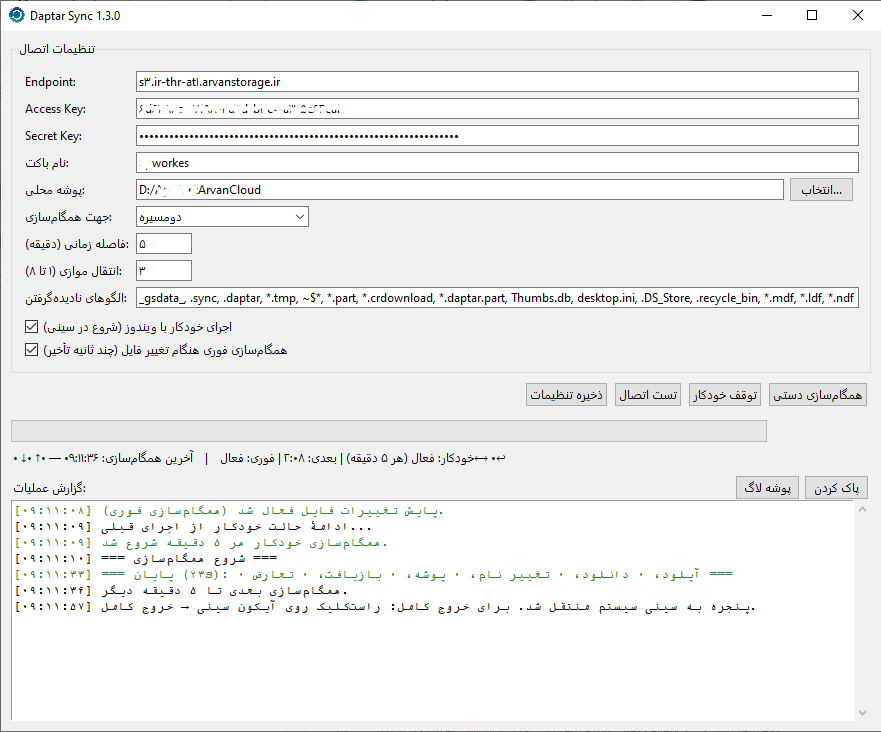

<p align="center">
  
</p>

<div dir="rtl">
# 🔄 Daptar Sync — همگام‌ساز خودکار S3
</div>

[]()
[]()
[]()
<div dir="rtl">
**Daptar Sync** یک ابزار سبک، پرتابل و رایگان برای همگام‌سازی خودکار پوشه‌ها با هر فضای ابری سازگار با S3 است — بدون نیاز به نصب، بدون وابستگی به سرویس خاص.
</div>
> 🇬🇧 [English documentation below](#-daptar-sync--automatic-s3-sync-tool)

---

## ✨ امکانات

- ☁️ **سازگار با همه سرویس‌های S3:** ابر آروان، AWS S3، Backblaze B2، Wasabi، MinIO و هر endpoint سازگار با S3
- 🔀 **سه جهت همگام‌سازی:** دومسیره (دو طرفه)، فقط آپلود، فقط دانلود
- ⚔️ **مدیریت تعارض هوشمند:** تشخیص ویرایش هم‌زمان یک فایل روی چند سیستم — نسخه جدیدتر پیروز می‌شود و نسخه قدیمی‌تر به سبد بازیافت می‌رود
- 🛡️ **حفاظت ویرایش در برابر حذف:** اگر فایلی که ویرایش شده از سیستم دیگری حذف شده باشد، ویرایش مقدم است (آپلود مجدد) — نه حذف!
- ♻️ **سبد بازیافت دوتایی:** فایل‌های حذف‌شده به‌جای پاک شدن دائمی، هم در پوشه `.recycle_bin` محلی و هم در باکت (`.recycle_bin/`) نگهداری می‌شوند — ۱۴ روز فرصت بازیابی
- ⚡ **همگام‌سازی فوری:** با تغییر فایل (بدون انتظار برای تایمر) با استفاده از watchdog — مصرف CPU تقریباً صفر
- ⏰ **همگام‌سازی زمان‌بندی‌شده:** فاصله دلخواه (پیش‌فرض ۱۰ دقیقه)
- 📌 **سینی سیستم (System Tray):** بستن پنجره = ادامه کار در پس‌زمینه؛ Tooltip نشان می‌دهد آخرین همگام‌سازی کی و با چند فایل بوده
- 🚀 **اجرای خودکار با ویندوز:** شورتکات استاندارد با آیکون برنامه، اجرای مخفی در سینی هنگام بوت
- 🔐 **تنظیمات رمزنگاری‌شده:** با Fernet + حفاظت DPAPI ویندوز (مختص کاربر ویندوز) در `%APPDATA%\DaptarSync`
- 🚫 **الگوهای صرف‌نظر:** فایل‌ها و پوشه‌های ناخواسته (`*.tmp`, `~$*`, `_gsdata_`, ...)
- ⌨️ **سازگار با کیبورد فارسی:** میان‌برهای Ctrl+C/V/X/A مستقل از چیدمان کیبورد + منوی راست‌کلیک
- 📦 **کاملاً پرتابل:** بدون نصب، قابل حمل روی فلش، بدون نیاز به Python روی سیستم مقصد
- 🔒 **تک‌نمونه:** اجرای هم‌زمان دو نسخه ممکن نیست

---


## ⚙️ نحوه نصب 

```bash
فایل های موجود را بصورت بک فایل زیپ دانلود و در جای مناسب (درایور ویندوز) استخراج کنید.
سپس فقط کافیست فایل build.bat را اجرا کنید تا نسخه اجرایی ایجاد شود. 
پیش نیاز بصورت خودکار از اینترنت نصب می شوند.
فایل اجرایی در پوشه dist و Daptar Sync ایجاد می شود.
```


### تنظیمات اتصال

| فیلد | توضیح | مثال (ابر آروان) |
|------|-------|------------------|
| Endpoint | آدرس سرویس S3 | `https://s3.arvancloud.ir` |
| Access Key | کلید دسترسی | — |
| Secret Key | کلید محرمانه | — |
| نام باکت | باکت مقصد | `my-bucket` |
| پوشه محلی | پوشه‌ای که باید همگام شود | `D:\Documents` |

---

## 🖥️ استفاده روی چند سیستم (خانگی + محل کار)

روی هر سیستم:

1. همان Endpoint / کلیدها / باکت را وارد کن و جهت را **bidirectional** بگذار.
2. **قبل از اولین اجرا** مطمئن شو هیچ ابزار همگام‌سازی دیگری (GoodSync و مانند آن) روی این پوشه فعال نیست.
3. ساعت ویندوز را روی حالت خودکار + Sync قرار بده.
4. قبل از خاموش کردن سیستم، اجازه بده آخرین همگام‌سازی تمام شود (Tooltip سینی را ببین).

> 💡 فایل state هر ماشین مستقل است و بین سیستم‌ها منتقل نمی‌شود.

---

## ⚙️ ساخت از سورس (برای توسعه‌دهندگان)

```bash
# پیش‌نیاز: Python 3.9 یا جدیدتر (ویندوز 64 بیتی)
git clone https://github.com/YOUR-USERNAME/DaptarSync.git
cd DaptarSync

# روش خودکار:
install.bat   # نصب وابستگی‌ها + PyInstaller
build.bat     # ساخت خروجی در dist\DaptarSync
```

یا دستی:

```bash
pip install -r requirements.txt
pip install pyinstaller
python -m PyInstaller --windowed --onedir --name DaptarSync daptar_sync.py
```

---

## 📁 فایل‌ها و مسیرهای مهم

| مسیر | توضیح |
|------|-------|
| `%APPDATA%\DaptarSync\config.enc` | تنظیمات رمزشده |
| `%APPDATA%\DaptarSync\secret.key` | کلید رمزنگاری (حفاظت‌شده با DPAPI) |
| `daptarsync.log` (کنار exe) | لاگ چرخشی برنامه |
| `<پوشه همگام‌سازی>\.sync_state.json` | وضعیت مقایسه (مختص هر ماشین) |
| `<پوشه همگام‌سازی>\.recycle_bin\` | سبد بازیافت محلی (۱۴ روز) |

> ⚠️ **نکته امنیتی:** کلید رمزنگاری با DPAPI به کاربر ویندوز و سیستم فعلی قفل شده است. اگر پوشه برنامه را به سیستم دیگری منتقل کنی، باید یک‌بار اطلاعات اتصال را دوباره وارد کنی — این عمدی است.

---

## ❓ عیب‌یابی

| مشکل | راه‌حل |
|------|--------|
| هشدار SmartScreen هنگام اجرا | More info → Run anyway (بدون گواهی دیجیتال طبیعی است) |
| آیکون exe بعد از بیلد جدید قدیمی است | کش آیکون ویندوز؛ فایل را Rename کن یا Explorer را ری‌استارت کن |
| فیلدهای اتصال بعد از ری‌استارت خالی‌اند | لاگ `daptarsync.log` را ببین؛ احتمالاً شورتکات استارت‌آپ به کپی قدیمی برنامه اشاره می‌کرده (نسخه‌های جدید خودکار ترمیم می‌کنند) |
| اجرای خودکار کار نمی‌کند | تیک گزینه را یک‌بار بردار و دوباره بزن (اگر پوشه برنامه را جابه‌جا کرده‌ای لازم است) |
| فایلی اشتباه حذف شد | پوشه `.recycle_bin` محلی یا پوشه `.recycle_bin/` در باکت (تا ۱۴ روز) |
| همگام‌سازی مدام اجرا می‌شود | فایل‌های موقت را به الگوهای صرف‌نظر اضافه کن (`~$*`, `*.tmp`, ...) |

---
</div>
<div align="center">

ساخته‌شده با ❤️ و Python

</div>

</div>

---

# 🔄 Daptar Sync — Automatic S3 Sync Tool

A lightweight, **portable** Windows application for automatic folder synchronization with any S3-compatible cloud storage — no installation, no vendor lock-in.

> 🇮🇷 [مستندات فارسی در بالا](#-daptar-sync--همگام‌ساز-خودکار-s3)

---

## ✨ Features

- ☁️ **Any S3-compatible provider:** ArvanCloud, AWS S3, Backblaze B2, Wasabi, MinIO, and more
- 🔀 **Three sync directions:** bidirectional, upload-only, download-only
- ⚔️ **Smart conflict handling:** detects simultaneous edits on multiple machines — the newer version wins, the older one goes to the recycle bin
- 🛡️ **Edit-vs-delete protection:** if an edited file was deleted on another machine, the edit is preserved (re-uploaded) — never silently lost
- ♻️ **Dual recycle bin:** deleted files are kept both locally (`.recycle_bin`) and on the bucket (`.recycle_bin/`) for **14 days**
- ⚡ **Instant sync:** file changes trigger sync within seconds (watchdog) — near-zero CPU usage
- ⏰ **Scheduled sync:** configurable interval (default: 10 minutes)
- 📌 **System tray:** closing the window keeps the app running; tooltip shows the last successful sync
- 🚀 **Windows autostart:** standard shortcut with the app icon, starts minimized in the tray
- 🔐 **Encrypted settings:** Fernet + Windows DPAPI (bound to your Windows user) in `%APPDATA%\DaptarSync`
- 🚫 **Ignore patterns:** skip unwanted files/folders (`*.tmp`, `~$*`, `_gsdata_`, ...)
- ⌨️ **Keyboard-layout independent:** Ctrl+C/V/X/A work with any layout (including Persian) + right-click menu
- 📦 **Fully portable:** single folder, runs without Python or installation on the target PC
- 🔒 **Single instance:** only one copy runs at a time

---

### Connection settings

| Field | Description | Example (ArvanCloud) |
|-------|-------------|----------------------|
| Endpoint | S3 service URL | `https://s3.arvancloud.ir` |
| Access Key | Access key ID | — |
| Secret Key | Secret access key | — |
| Bucket | Target bucket name | `my-bucket` |
| Local folder | Folder to keep in sync | `D:\Documents` |

---

## 🖥️ Multi-PC setup (home + office)

On each machine:

1. Enter the **same** endpoint / keys / bucket and set direction to **bidirectional**.
2. **Before the first run**, make sure no other sync tool (GoodSync, etc.) is active on this folder.
3. Keep Windows clock set to automatic time sync.
4. Before shutting down a machine, let the last sync finish (check the tray tooltip).

> 💡 The sync state file is per-machine and never synced between systems.

---

## ⚙️ Build from source

```bash
# Requirements: Python 3.9+ (Windows 64-bit)
git clone https://github.com/YOUR-USERNAME/DaptarSync.git
cd DaptarSync

# Automated:
install.bat   # installs dependencies + PyInstaller
build.bat     # output goes to dist\DaptarSync
```

Or manually:

```bash
pip install -r requirements.txt
pip install pyinstaller
python -m PyInstaller --windowed --onedir --name DaptarSync daptar_sync.py
```

---

## 📁 Important files & paths

| Path | Description |
|------|-------------|
| `%APPDATA%\DaptarSync\config.enc` | Encrypted settings |
| `%APPDATA%\DaptarSync\secret.key` | Encryption key (DPAPI-protected) |
| `daptarsync.log` (next to exe) | Rotating log file |
| `<sync folder>\.sync_state.json` | Comparison state (per machine) |
| `<sync folder>\.recycle_bin\` | Local recycle bin (14 days) |

> ⚠️ **Security note:** The encryption key is locked to your Windows user via DPAPI. If you move the app folder to another PC, you must re-enter your credentials once — by design.

---

## ❓ Troubleshooting

| Problem | Solution |
|---------|----------|
| SmartScreen warning on first run | More info → Run anyway (normal without a code-signing certificate) |
| Old EXE icon after rebuilding | Windows icon cache — rename the file or restart Explorer |
| Connection fields empty after reboot | Check `daptarsync.log`; the startup shortcut may have pointed to an older copy (newer versions self-repair) |
| Autostart not working | Toggle the checkbox off/on (required after moving the app folder) |
| A file was deleted by mistake | Restore from `.recycle_bin` locally or `.recycle_bin/` in the bucket (within 14 days) |
| Sync keeps running repeatedly | Add temp-file patterns to the ignore list (`~$*`, `*.tmp`, ...) |

---

<div align="center">

Made with ❤️ and Python

